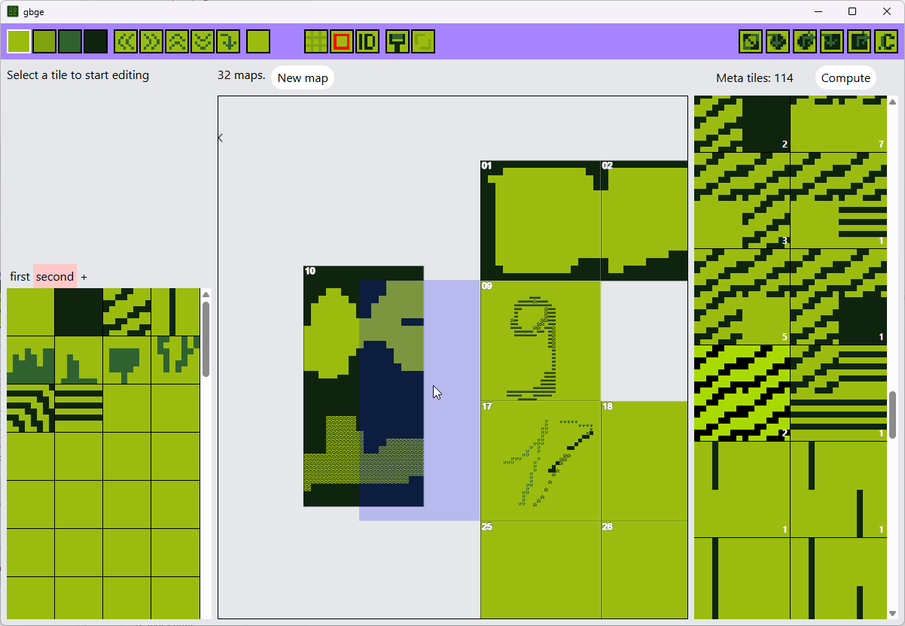

# GBGE

GBGE is a tool for creating and editing Game Boy maps.  
Metatiles are a byproduct, allowing you to think and create freely. (You can still paint using metatiles if you like)

## Features

### Create and edit tile sets

### Create and edit maps

You can also copy/paste part of maps using the selection tool.

### Compute, count and optimize metatiles usage

### Export to C files

Also generated header files for the tile sets and maps.

### Rearrange maps

## Missing features / todo

- Click to fill
- Export all tilesets at once rather than only the active one
- Limit tileset export to only used tiles
- Undo/redo
