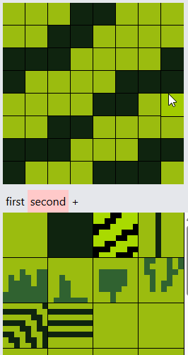
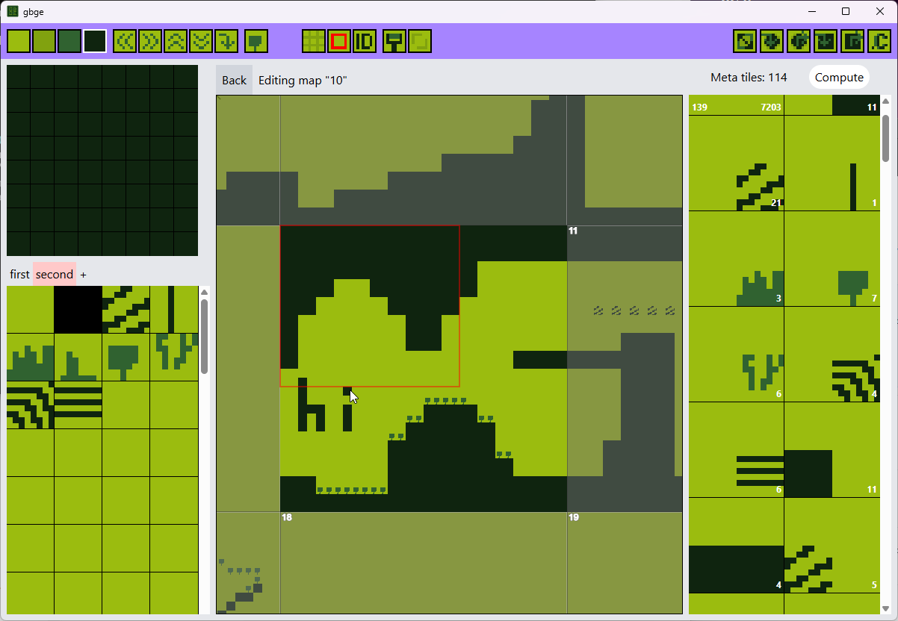
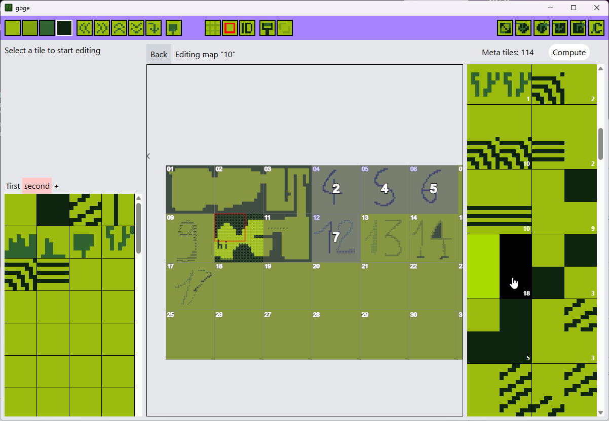
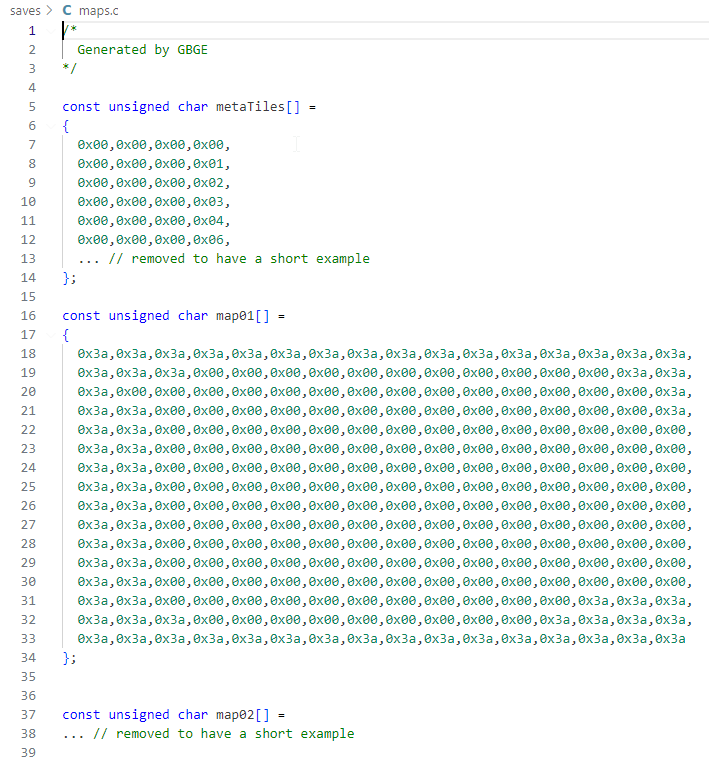

# GBGE

GBGE is a tool for creating and editing Game Boy maps.  
Metatiles are a byproduct, allowing you to think and create freely.

## Features

### Create and edit tile sets

### Create and edit maps

### Compute, count and optimize metatiles

### Export to C files

## Missing features / todo

- Click to fill
- Export all tilesets at once rather than only the active one
